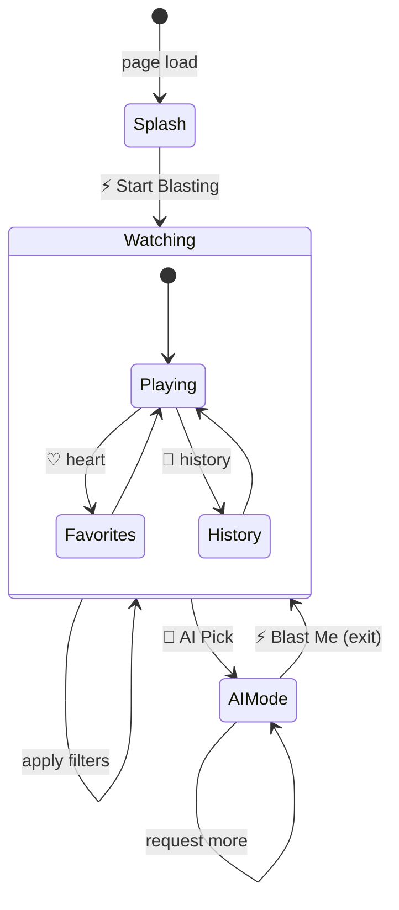
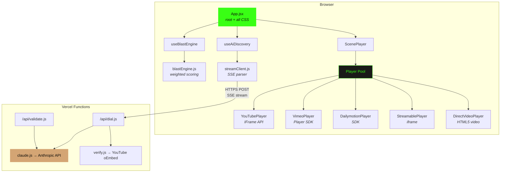
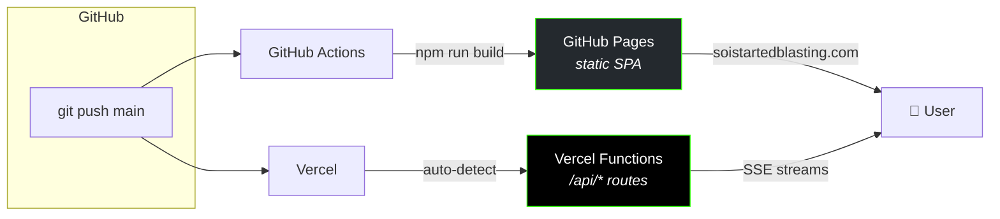
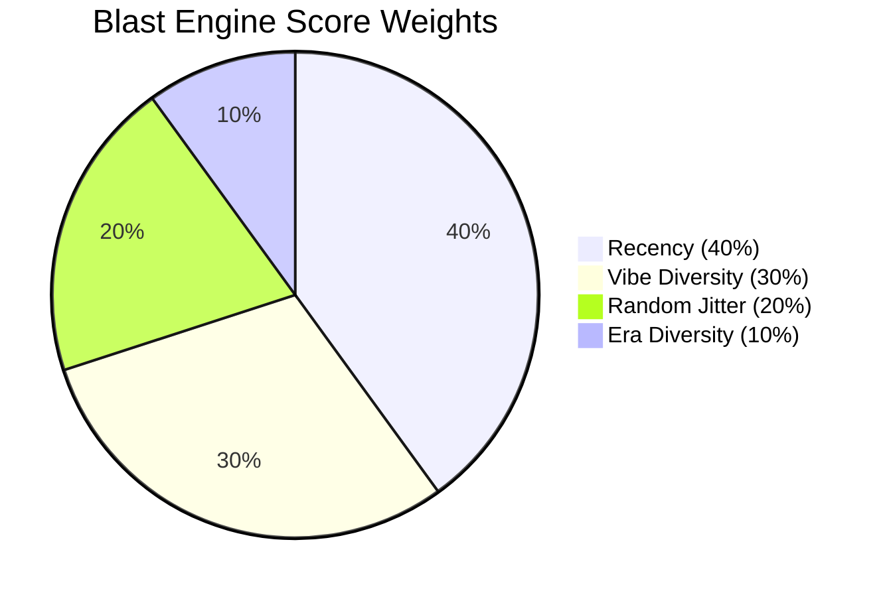
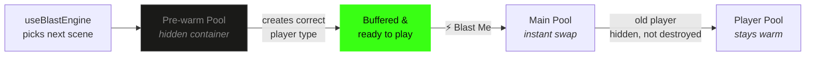
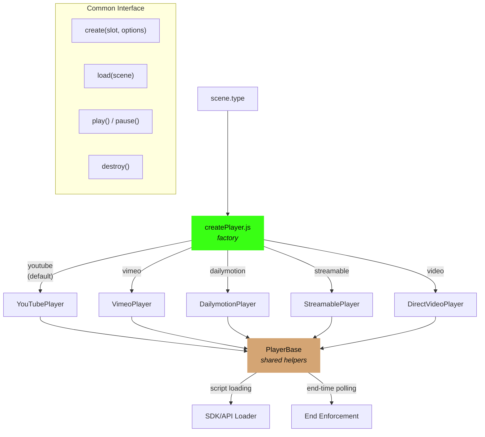
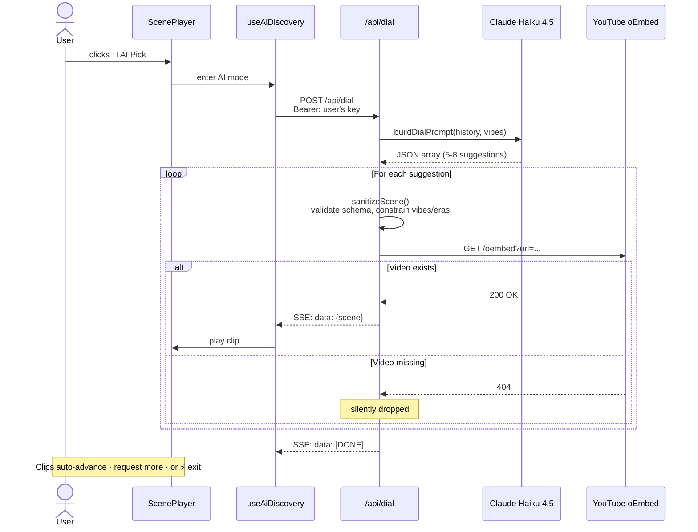

# 📺 Channel Zero

A pirate-TV web app that blasts random video clips in a CRT television UI. 400+ curated clips from YouTube, Vimeo, and Dailymotion spanning internet history — from Dancing Baby to modern chaos — with an AI discovery engine that finds new clips based on your viewing habits.

*"We're experiencing technical difficulties."*

**Live at [soistartedblasting.com](https://soistartedblasting.com)**

---

## What It Does

**Core experience:** Click in and watch. Clips auto-advance when they end. Hit ⚡ Blast Me to channel-surf. Filter by vibe or era to steer the chaos. Save favorites. Let the internet wash over you.

**AI Discovery:** Bring your own Claude API key to unlock AI Pick mode — click the 📡 button on the TV and Claude suggests clips based on your watch history, verified against YouTube in real-time, and streamed to your TV one at a time.

### Full Feature List

| Feature | Description |
|---------|-------------|
| **Random clips** | Weighted selection algorithm balances recency, vibe diversity, and era variety |
| **400+ clips** | Curated library spanning ancient web → early internet → viral classics → modern chaos |
| **Multi-source video** | YouTube, Vimeo, Dailymotion, Streamable, and direct MP4/WebM — player pool keeps instances warm |
| **19 vibe filters** | Chaotic Energy, Legendary Fails, Iconic Cinema, Cursed Content, Unhinged Wisdom, and 14 more |
| **4 era filters** | Ancient Web, Early Internet, Viral Classics, Modern Chaos |
| **Favorites** | Heart any clip to save it (persisted in localStorage) |
| **Watch history** | Browse your last 50 watched clips with timestamps |
| **AI Pick** | Claude-powered clip suggestions streamed via SSE (BYOK) |
| **Error recovery** | Dead or non-embeddable videos auto-skip seamlessly |
| **CRT TV chrome** | Retro bezel, channel-change transitions (static → color bars → vertical hold roll) |

---

## How to Use It



### Basic Mode

1. Click **⚡ Start Blasting** on the splash screen (enables audio)
2. Click **⚡ Blast Me** to channel-surf to a random clip
3. Use the **filter bar** to narrow by vibe or era (multi-select, AND logic)
4. Click **♡** on any clip to save it to favorites
5. Click **♥** in the header to view and replay saved clips
6. Click **📼 History** to browse recently watched clips
7. Or just sit back — clips auto-advance when they end

### AI Discovery

1. Click the **📡 AI Pick** button on the TV
2. First time: paste your **Claude API key** in the inline input
3. Key validates automatically — green means go
4. Claude suggests clips based on your watch history
5. Verified clips stream in one at a time
6. Click **⚡ Blast Me** to exit back to normal mode

---

## Architecture

### High-Level



### Tech Stack

| Layer | Technology |
|-------|------------|
| Framework | React 18 (client-side SPA) |
| Build | Vite 8 |
| Styling | CSS-in-JS (template literal in App.jsx) |
| Video | Multi-source player pool (YouTube IFrame API, Vimeo SDK, Dailymotion SDK, Streamable iframe, HTML5 `<video>`) |
| State | React hooks + localStorage (no external state library) |
| AI | Claude Haiku 4.5 via Anthropic API (BYOK) |
| Streaming | `fetch()` + `ReadableStream` (SSE format) |
| API | Vercel Serverless Functions |
| Hosting | GitHub Pages (static) + Vercel (API routes) |
| CI/CD | GitHub Actions (auto-deploy on push to `main`) |

**Dependencies:** React and React DOM. That's it.

### Hosting & Deployment



### Project Structure

```
src/
├── App.jsx                  # Root component + ALL CSS
├── main.jsx                 # React 18 createRoot entry
├── data/
│   ├── scenes.js            # 400+ clips (4600+ lines) — the content library
│   └── filters.js           # 19 vibes + 4 eras, matching logic
├── engine/
│   └── blastEngine.js       # Weighted scoring algorithm
├── players/
│   ├── createPlayer.js      # Factory: scene type → player instance
│   ├── PlayerBase.js        # Shared helpers (script loader, end-time enforcement)
│   ├── YouTubePlayer.js     # YouTube IFrame API wrapper
│   ├── VimeoPlayer.js       # Vimeo Player SDK wrapper
│   ├── StreamablePlayer.js  # Streamable iframe embed
│   ├── DailymotionPlayer.js # Dailymotion Player SDK wrapper
│   └── DirectVideoPlayer.js # HTML5 <video> for MP4/WebM URLs
├── lib/
│   └── streamClient.js      # fetch + ReadableStream SSE parser
├── hooks/
│   ├── useBlastEngine.js    # Scene selection with diversity scoring + pre-warming
│   ├── useRandomScene.js    # Simple random selection with recency buffer (legacy)
│   ├── useFavorites.js      # localStorage favorites (key: sisb-favorites)
│   ├── useWatchHistory.js   # localStorage history, max 50 (key: sisb-watch-history)
│   ├── useApiKey.js         # Claude API key management (key: sisb-api-key)
│   └── useAiDiscovery.js    # AI mode state manager (discoveries)
└── components/
    ├── ScenePlayer.jsx      # Multi-source player pool + CRT TV chrome + AI Pick
    ├── FilterBar.jsx        # Grouped vibe/era filter pills
    ├── FilterDropdown.jsx   # Category selector
    ├── FavoritesList.jsx    # Slide-out favorites panel
    ├── HistoryList.jsx      # Slide-out watch history panel
    ├── SceneCard.jsx        # Card for favorites/history lists
    ├── NeonButton.jsx       # Styled button component
    └── Toast.jsx            # Notification toast

api/                         # Vercel serverless functions
├── dial.js                  # SSE endpoint — AI clip discovery
├── validate.js              # API key validation
└── _lib/
    ├── claude.js            # Claude API client (BYOK, per-request key)
    ├── verify.js            # YouTube oEmbed verification
    └── prompts.js           # Prompt templates + vocabulary constants
```

---

## The Blast Engine

The app doesn't just pick random clips — it uses a **weighted multi-factor scoring algorithm** to maximize variety and minimize repetition.

### How It Scores

Every candidate scene gets a score from 0 to 1 based on four factors:

| Factor | Weight | What It Does |
|--------|--------|-------------|
| **Recency** | 40% | Recently played scenes get suppressed. Cooldown window = 50% of pool size. |
| **Vibe Diversity** | 30% | Penalizes clips with overlapping vibes from last 5 watches. |
| **Era Diversity** | 10% | Penalizes same era as last 3 watches. |
| **Random Jitter** | 20% | `Math.random()` ensures non-deterministic ordering. |

The highest-scoring scene wins. History tracks 200 plays. Pre-computation picks the next-next scene for player pre-warming.



### Pre-Warming



Two player pools run simultaneously:

1. **Main player pool** — plays the current clip using the appropriate player type
2. **Hidden pre-warm pool** — silently loads the predicted next clip in a hidden container

When you blast, the next clip is already buffered. If the next clip uses a different source (e.g., YouTube → Vimeo), the pre-warm pool initializes the correct player type ahead of time.

---

## Multi-Source Player Architecture

ScenePlayer manages a **player pool** — one player instance per video source type, kept alive in the DOM. When switching between clips of different types, the pool hides the outgoing player's slot and shows the incoming one. This avoids destroying and recreating expensive iframes on every scene change.



### Supported Sources

| Type | Player | SDK/API | Notes |
|------|--------|---------|-------|
| `youtube` (default) | YouTubePlayer | YouTube IFrame API | Most clips; muted autoplay, triple volume redundancy |
| `vimeo` | VimeoPlayer | Vimeo Player SDK | Uses `timeupdate` for end-time enforcement |
| `dailymotion` | DailymotionPlayer | Dailymotion Player SDK | Uses `timeupdate` for end-time enforcement |
| `streamable` | StreamablePlayer | iframe embed | Simple embed, `setTimeout` for clip duration |
| `video` | DirectVideoPlayer | HTML5 `<video>` | Direct MP4/WebM URLs, `timeupdate` for clipping |

All players implement a common interface: `create(slot, options)`, `load(scene)`, `play()`, `pause()`, `destroy()` — with callback-based events (`onReady`, `onEnd`, `onError`).

The factory (`createPlayer.js`) maps `scene.type` to the correct player class. Scenes without a `type` field default to `youtube` for backward compatibility.

---

## AI Discovery Pipeline

### How It Works



### Verification

Claude suggests YouTube video IDs from its training knowledge. Before streaming each suggestion to the client, the server validates it exists via YouTube oEmbed (`GET https://www.youtube.com/oembed?url=...`). Invalid suggestions are silently dropped — the user just gets fewer results.

### Prompt Design

The prompt includes:
- The user's recent watch history (resolved to full scene objects with titles, vibes, eras)
- The complete list of valid vibes and eras (preventing Claude from inventing tags)
- Instructions to return a JSON array with specific fields
- Emphasis on well-known, iconic YouTube content

---

## YouTube Player Gotchas

These are hard-won lessons from fighting the YouTube IFrame API:

- **Autoplay requires mute.** Videos start muted for browser compliance. Audio enables after the user's first interaction.
- **Triple volume redundancy.** Volume is set to 100 in `onReady`, `onStateChange(PLAYING)`, and a `useEffect` on `hasInteracted`. This triple-set is intentional — YouTube API has timing quirks where any single set can be ignored.
- **Spurious "ended" events.** The player sometimes fires state `0` (ended) before the clip actually ends. A guard checks `currentTime` proximity to the clip's `end` timestamp.
- **Error auto-advance.** Codes 100 (not found), 101/150 (not embeddable) trigger auto-skip. Code 5 (HTML5 error) does not — it might recover.
- **Player pool pattern.** YouTube players are created once and kept alive in a pool. Scene changes call `loadVideoById()` on the existing player — no destroy/recreate cycle. Cross-type switches hide the YouTube slot and show the new type's slot.

---

## Clip Data Schema

Each entry in `src/data/scenes.js`:

```js
{
  id: "techno-viking",           // Unique kebab-case identifier
  type: "youtube",               // Optional: youtube (default), vimeo, streamable, dailymotion, video
  videoId: "UjCdB5p2v0Y",       // Platform video ID (YouTube/Vimeo/Streamable/Dailymotion)
  videoUrl: "https://...",       // For type: "video" only (direct MP4/WebM URL)
  start: 0,                      // Start timestamp (seconds)
  end: 30,                       // End timestamp (seconds)
  quote: "He points. You obey.", // Displayed under the TV
  description: "The Viking commands the street parade.",
  vibes: ["chaotic-energy"],     // 1+ vibes from VALID_VIBES
  era: "early-internet",         // Single era from VALID_ERAS
  source: { title: "Techno Viking", year: 2000 }
}
```

The `type` field is optional — omitting it defaults to `"youtube"` for backward compatibility with the original clip library.

**Vibes** (19): chaotic-energy, dangerous, epic-fight-scenes, disturbing, unhinged, unhinged-wisdom, unhinged-shorts, cursed-content, weird-flex, wholesome-chaos, chaotic-good, pure-nostalgia, awkward-gold, epic-recovery, iconic-cinema, legendary-fails, musical-mayhem, synchronicity, funny-revenge

**Eras** (4): ancient-web, early-internet, viral-classics, modern-chaos

### Adding Clips

1. Find the video and note the platform video ID (or direct URL for MP4/WebM)
2. Pick a 15-60 second window (start/end) capturing the iconic moment
3. Write a memorable quote and short description
4. Assign 1-2 vibes and 1 era
5. Add the `type` field if not YouTube (e.g., `type: "vimeo"`)
6. Add the object to `SCENES` in `src/data/scenes.js`
7. Add any new vibes/eras to `src/data/filters.js`

For bulk additions, use `scripts/add-new-scenes.js` to programmatically append clips — manual editing of the 4600+ line file is fragile.

---

## localStorage Keys

All keys prefixed `sisb-` (so-i-started-blasting):

| Key | Purpose | Cap |
|-----|---------|-----|
| `sisb-blast-history` | Play history for the scoring algorithm | 200 IDs |
| `sisb-favorites` | Saved clip IDs | Unlimited |
| `sisb-watch-history` | Recently watched with timestamps | 50 entries |
| `sisb-api-key` | Claude API key (raw string) | 1 |
| `sisb-ai-discoveries` | Rolling log of AI-discovered clips | 50 scenes |

---

## Development

```bash
npm install
npm run dev          # Vite dev server on port 3000 (frontend only)
vercel dev           # Full stack: Vite + serverless API routes
npm run build        # Production build → dist/
npm run preview      # Preview production build
```

**`npm run dev`** serves the frontend only — AI features won't work (no API routes).

**`vercel dev`** runs both the Vite frontend and the `/api` serverless functions locally. Requires `vercel link` first.

### Design Language

Pirate TV aesthetic — dark background (`#0a0a08`), neon green (`#39ff14`) branding, Special Elite typewriter font for quotes, monospace for tech elements. CRT TV frame with channel-change transitions (white flash → static → SMPTE color bars → vertical hold roll). Noise texture overlay across the entire page.
