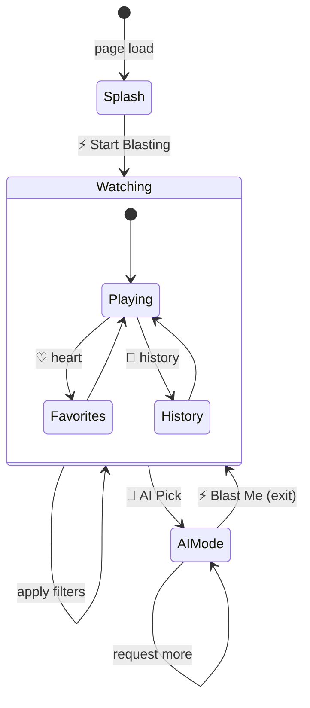
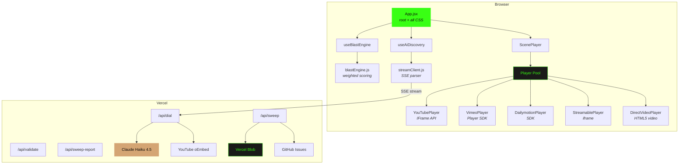
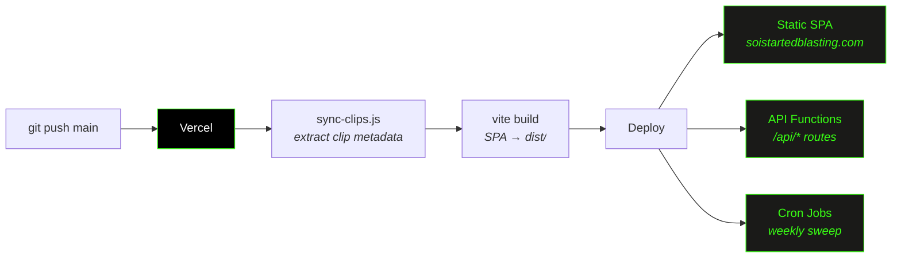
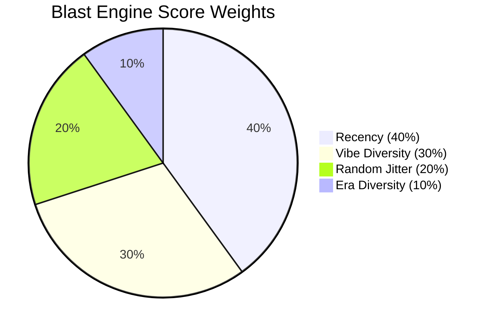
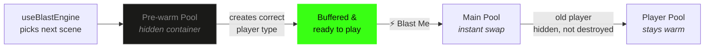
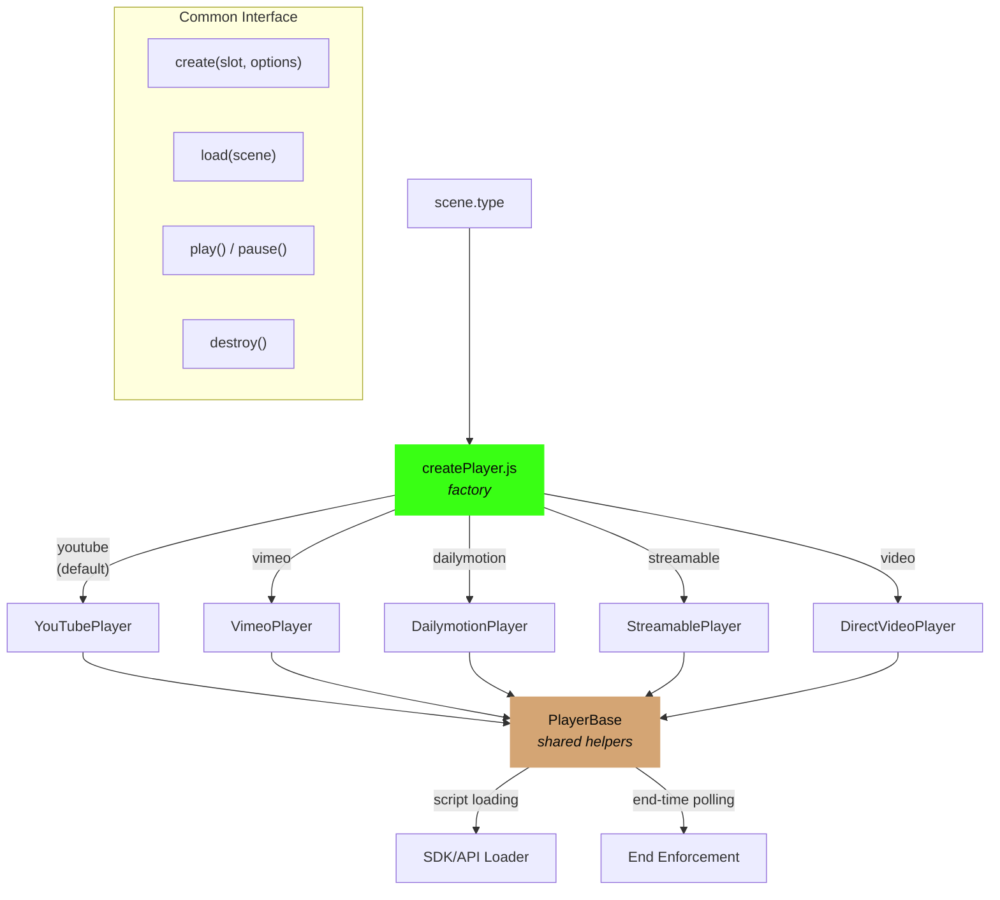
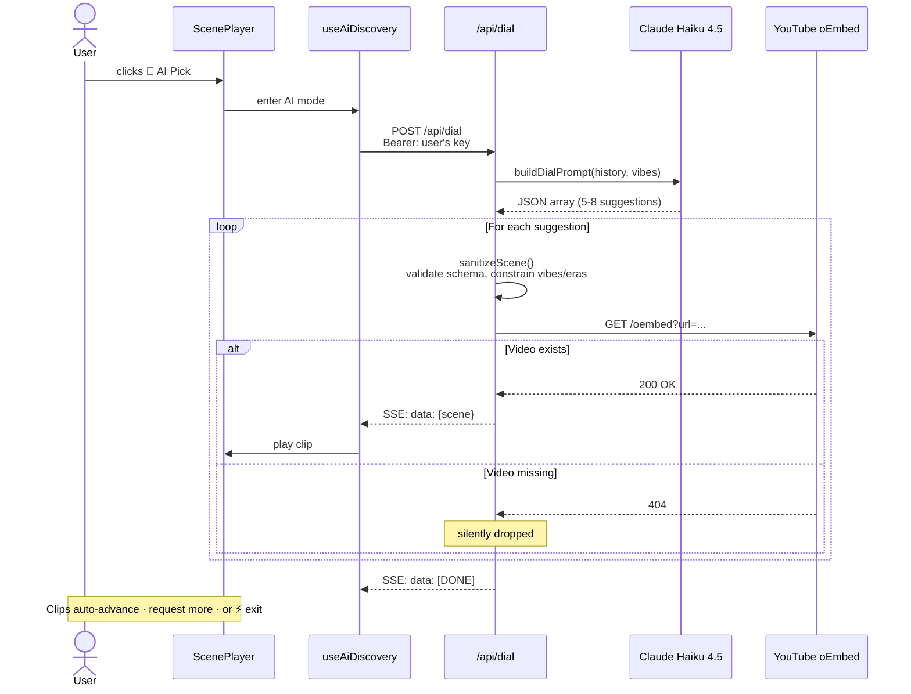
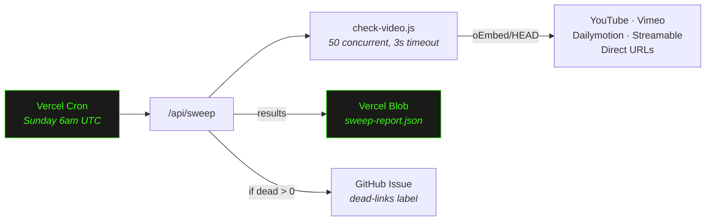

# 📺 Channel Zero

A pirate-TV web app that blasts random video clips through a CRT television you can't turn off. 416 curated clips from YouTube, Vimeo, and Dailymotion spanning the entire internet era — from Dancing Baby to modern chaos — with an AI engine that learns your taste and suggests more.

Nobody asked for this. You're welcome.

**Live at [soistartedblasting.com](https://soistartedblasting.com)**

---

## What It Does

**The short version:** Click a button. Watch a clip. Click it again. Repeat until you've wasted an hour. Congratulations, you've been blasted.

**The longer version:** Channel Zero is a retro pirate TV station simulator. It plays curated 15–60 second clips from across internet history in a CRT television UI. A weighted scoring algorithm maximizes variety across vibes and eras while suppressing recently-played clips. An optional AI mode (BYOK Claude API key) suggests new clips based on your watch history, verified in real-time, and streamed to your TV one at a time.

### Feature List

| Feature | Description |
|---------|-------------|
| **⚡ Blast Me** | Weighted selection algorithm balances recency, vibe diversity, and era variety |
| **416 clips** | Curated library spanning Ancient Web → Early Internet → Viral Classics → Modern Chaos |
| **Multi-source video** | YouTube, Vimeo, Dailymotion, Streamable, and direct MP4/WebM — player pool keeps instances warm |
| **19 vibe filters** | Chaotic Energy, Legendary Fails, Iconic Cinema, Cursed Content, Unhinged Wisdom, and 14 more |
| **4 era filters** | Ancient Web, Early Internet, Viral Classics, Modern Chaos |
| **Favorites** | Heart any clip to save it (persisted in localStorage) |
| **Watch history** | Browse your last 50 watched clips with timestamps |
| **📡 AI Pick** | Claude-powered clip suggestions streamed via SSE (bring your own API key) |
| **Error recovery** | Dead or non-embeddable videos auto-skip seamlessly |
| **CRT TV chrome** | Retro bezel, channel-change transitions (static → color bars → vertical hold roll) |
| **Dead link sweeper** | Weekly cron job validates all 416 clips and files GitHub Issues for broken links |

---

## How to Use It



### Normal Mode

1. Click **⚡ Start Blasting** on the splash screen (this enables audio — browsers won't let us unmute without your consent, we tried)
2. Click **⚡ Blast Me** to channel-surf to a random clip
3. Use the **filter pills** to narrow by vibe or era (multi-select, AND logic)
4. Click **♡** on any clip to save it to favorites
5. Click **♥** in the header to view and replay saved clips
6. Click **📼 History** to browse recently watched clips
7. Or just sit back — clips auto-advance when they end, like real TV but worse

### AI Discovery

1. Click the **📡 AI Pick** button on the TV
2. First time: paste your **Claude API key** in the inline input
3. Key validates automatically — green means go
4. Claude suggests clips based on your watch history, verified against YouTube in real-time
5. Verified clips stream in one at a time
6. Click **⚡ Blast Me** to exit back to normal mode and pretend you were being productive

---

## Architecture

### High-Level



### Tech Stack

| Layer | Technology |
|-------|------------|
| Framework | React 18 (client-side SPA) |
| Build | Vite 8 |
| Styling | CSS-in-JS (one massive template literal in App.jsx, as god intended) |
| Video | Multi-source player pool (YouTube IFrame API, Vimeo SDK, Dailymotion SDK, Streamable iframe, HTML5 `<video>`) |
| State | React hooks + localStorage (no Redux, no context, no regrets) |
| AI | Claude Haiku 4.5 via Anthropic API (BYOK — your key, your bill) |
| Streaming | `fetch()` + `ReadableStream` (SSE format) |
| API | Vercel Serverless Functions |
| Hosting | Vercel (unified — SPA + API functions + cron jobs) |
| Storage | Vercel Blob (sweep reports) |
| CI/CD | Vercel auto-deploy on push to `main` |

**Runtime dependencies:** `react`, `react-dom`, `@vercel/blob`. That's the whole `dependencies` block. We don't believe in bloat.

### Hosting & Deployment



Single pipeline: push to `main` → Vercel runs `sync-clips.js` (extracts clip metadata for serverless functions) → builds the Vite SPA → deploys everything. No GitHub Actions, no split pipelines, no drama.

### Project Structure

```
src/
├── App.jsx                  # Root component + ALL CSS (yes, all of it)
├── main.jsx                 # React 18 createRoot entry
├── data/
│   ├── scenes.js            # 416 clips — the content library
│   └── filters.js           # 19 vibes + 4 eras, matching logic
├── engine/
│   └── blastEngine.js       # Weighted scoring algorithm
├── players/
│   ├── createPlayer.js      # Factory: scene type → player instance
│   ├── PlayerBase.js        # Shared helpers (script loader, end-time enforcement)
│   ├── YouTubePlayer.js     # YouTube IFrame API wrapper
│   ├── VimeoPlayer.js       # Vimeo Player SDK wrapper
│   ├── StreamablePlayer.js  # Streamable iframe embed
│   ├── DailymotionPlayer.js # Dailymotion Player SDK wrapper
│   └── DirectVideoPlayer.js # HTML5 <video> for MP4/WebM URLs
├── lib/
│   └── streamClient.js      # fetch + ReadableStream SSE parser
├── hooks/
│   ├── useBlastEngine.js    # Scene selection + pre-warming
│   ├── useRandomScene.js    # Simple random with recency buffer (legacy)
│   ├── useFavorites.js      # localStorage favorites
│   ├── useWatchHistory.js   # localStorage history (max 50)
│   ├── useApiKey.js         # Claude API key management (BYOK)
│   └── useAiDiscovery.js    # AI mode state machine
└── components/
    ├── ScenePlayer.jsx      # CRT TV + player pool + AI controls
    ├── FilterBar.jsx        # Grouped vibe/era filter pills
    ├── FavoritesList.jsx    # Slide-out favorites panel
    ├── HistoryList.jsx      # Slide-out watch history panel
    ├── SceneCard.jsx        # Card for favorites/history lists
    ├── NeonButton.jsx       # Styled button component
    └── Toast.jsx            # Notification toast

scripts/
└── sync-clips.js            # Extracts clip metadata → api/_lib/scenes-data.js

api/                         # Vercel serverless functions
├── dial.js                  # SSE endpoint — AI clip discovery
├── validate.js              # API key validation
├── sweep.js                 # Cron: weekly dead link checker
├── sweep-report.js          # Returns latest sweep results
└── _lib/
    ├── claude.js            # Claude API client (BYOK, per-request key)
    ├── verify.js            # YouTube oEmbed verification
    ├── prompts.js           # Prompt templates + vocabulary constants
    ├── check-video.js       # oEmbed/HEAD liveness checker
    └── scenes-data.js       # Auto-generated clip metadata (don't edit)
```

---

## The Blast Engine

The app doesn't just pick random clips — it uses a **weighted multi-factor scoring algorithm** because random selection is for amateurs who enjoy watching the same clip three times in a row.

### How It Scores

Every candidate scene gets a score from 0 to 1 based on four factors:

| Factor | Weight | What It Does |
|--------|--------|-------------|
| **Recency** | 40% | Recently played scenes get suppressed. Cooldown window = 50% of pool size. |
| **Vibe Diversity** | 30% | Penalizes clips sharing vibes with your last 5 watches. |
| **Era Diversity** | 10% | Penalizes same era as your last 3 watches. |
| **Random Jitter** | 20% | `Math.random()` ensures you can't predict what's next. |

The highest-scoring scene wins. History tracks 200 plays. The engine immediately pre-computes the *next* scene for player pre-warming — so when you blast, the clip is already buffered.



### Pre-Warming



Two player pools run simultaneously:

1. **Main player pool** — plays the current clip
2. **Hidden pre-warm pool** — silently loads the next clip in a hidden container

When you blast, the next clip is already buffered. If it uses a different source (YouTube → Vimeo), the correct player type is initialized ahead of time. Players are never destroyed — they're pooled and reused.

---

## Multi-Source Player Architecture

ScenePlayer manages a **player pool** — one instance per video source type, kept alive in the DOM. Switching between clip types is a CSS `display: none/block` swap, not a destroy/recreate cycle. Your browser's RAM is our pooling strategy.



### Supported Sources

| Type | Player | SDK/API | Notes |
|------|--------|---------|-------|
| `youtube` (default) | YouTubePlayer | YouTube IFrame API | Most clips; muted autoplay, triple volume redundancy |
| `vimeo` | VimeoPlayer | Vimeo Player SDK | `timeupdate` for end-time enforcement |
| `dailymotion` | DailymotionPlayer | Dailymotion Player SDK | `timeupdate` for end-time enforcement |
| `streamable` | StreamablePlayer | iframe embed | Simple embed, `setTimeout` for clip duration |
| `video` | DirectVideoPlayer | HTML5 `<video>` | Direct MP4/WebM URLs, `timeupdate` for clipping |

All players implement a common interface: `create(slot, options)`, `load(scene)`, `play()`, `pause()`, `destroy()` — with callback-based events (`onReady`, `onEnd`, `onError`).

---

## AI Discovery Pipeline

### How It Works



### The BYOK Model

No server-side API keys. The user's Claude API key is passed in the `Authorization` header on every request and forwarded directly to the Anthropic API. We never store it server-side — it lives in your browser's localStorage until you disconnect it. Your key, your bill, our plausible deniability.

### Verification

Claude suggests YouTube video IDs from training knowledge. Before streaming each suggestion to the client, the server validates it exists via YouTube oEmbed. Invalid suggestions are silently dropped — you just get fewer results. Claude is creative, not accurate.

---

## Infrastructure

### Dead Link Sweeper

416 clips across 5 video platforms means links die constantly. A weekly cron job handles this so we don't have to.



- **Schedule:** Every Sunday at 6am UTC (configurable in `vercel.json`)
- **Concurrency:** 50 simultaneous checks, 3s timeout per request
- **Classification:** HTTP 200 → healthy, 404/403 → dead, timeout/error → unknown (no false positives)
- **Storage:** Results written to Vercel Blob as JSON, overwritten each run
- **Alerting:** Dead links trigger a GitHub Issue with a markdown table of affected clips
- **On-demand:** `GET /api/sweep-report` returns the latest results

### Build Pipeline

Vercel serverless functions can't import from `src/` — they're bundled separately. The `sync-clips.js` script bridges this gap:

```
src/data/scenes.js  →  scripts/sync-clips.js  →  api/_lib/scenes-data.js
     (416 clips)         (extracts metadata)        (lightweight copy)
```

This runs automatically as the first step of every Vercel build (`buildCommand` in `vercel.json`), so `scenes-data.js` is always current at deploy time. You can also run it manually: `npm run sync-clips`.

### API Endpoints

| Endpoint | Method | Auth | Purpose |
|----------|--------|------|---------|
| `/api/dial` | POST | Bearer (user's Claude key) | AI clip discovery via SSE streaming |
| `/api/validate` | POST | Bearer (user's Claude key) | Validates a Claude API key |
| `/api/sweep` | GET | Bearer (`CRON_SECRET`) | Cron-triggered dead link sweep |
| `/api/sweep-report` | GET | None | Returns latest sweep results from Blob |

### Rate Limiting

`/api/dial` and `/api/validate` are rate-limited via **Vercel Firewall WAF rules** — enforced at the edge before function cold-starts. Zero code, configured entirely in the Vercel dashboard:

| Endpoint | Limit | Action |
|----------|-------|--------|
| `/api/dial` | 5 req / 60s per IP | 429 Too Many Requests |
| `/api/validate` | 10 req / 60s per IP | 429 Too Many Requests |

### Environment Variables

| Variable | Source | Purpose |
|----------|--------|---------|
| `BLOB_READ_WRITE_TOKEN` | Vercel Blob Marketplace (auto-provisioned) | Read/write sweep report JSON |
| `GITHUB_TOKEN` | Personal access token with `repo` scope | Create GitHub Issues for dead links |
| `CRON_SECRET` | Auto-generated by Vercel | Verify cron invocations aren't random visitors |

The AI endpoints need **no server-side env vars** — the user's own Claude API key is passed per-request.

---

## YouTube Player Gotchas

These are hard-won lessons from fighting the YouTube IFrame API. They're documented here as a warning to future generations:

- **Autoplay requires mute.** Videos start muted for browser compliance. Audio enables after the user's first interaction. Blame Chrome, not us.
- **Triple volume redundancy.** Volume is set to 100 in `onReady`, `onStateChange(PLAYING)`, and a `useEffect` on `hasInteracted`. This looks insane. It is intentional. YouTube API has timing quirks where any single set can be silently ignored.
- **Spurious "ended" events.** The player sometimes fires state `0` (ended) before the clip actually ends. A guard checks `currentTime` proximity to the clip's `end` timestamp before trusting it.
- **Error auto-advance.** Codes 100 (not found), 101/150 (not embeddable) trigger auto-skip. Code 5 (HTML5 error) does not — it might recover on its own.
- **Player pool.** YouTube players are created once and kept alive. Scene changes call `loadVideoById()` — no destroy/recreate. Cross-type switches hide the YouTube slot and show the new type's slot.

---

## Clip Data Schema

Each entry in `src/data/scenes.js`:

```js
{
  id: "techno-viking",           // Unique kebab-case identifier
  type: "youtube",               // Optional: youtube (default), vimeo, streamable, dailymotion, video
  videoId: "UjCdB5p2v0Y",       // Platform video ID (YouTube/Vimeo/Streamable/Dailymotion)
  videoUrl: "https://...",       // For type: "video" only (direct MP4/WebM URL)
  start: 0,                      // Start timestamp (seconds)
  end: 30,                       // End timestamp (seconds)
  quote: "He points. You obey.", // Displayed under the TV
  description: "The Viking commands the street parade.",
  vibes: ["chaotic-energy"],     // 1+ vibes from the list below
  era: "early-internet",         // Single era from the list below
  source: { title: "Techno Viking", year: 2000 }
}
```

The `type` field is optional — omitting it defaults to `"youtube"` for backward compatibility with the original library.

**Vibes** (19 across 4 groups):
- 🔥 **Intense:** chaotic-energy, dangerous, epic-fight-scenes, disturbing
- 🤪 **Unhinged:** unhinged, unhinged-wisdom, unhinged-shorts, cursed-content, weird-flex
- 😌 **Good Vibes:** wholesome-chaos, chaotic-good, pure-nostalgia, awkward-gold, epic-recovery
- 🎬 **Entertainment:** iconic-cinema, legendary-fails, musical-mayhem, synchronicity, funny-revenge

**Eras** (4): ancient-web, early-internet, viral-classics, modern-chaos

### Adding Clips

1. Find the video and note the platform video ID (or direct URL for MP4/WebM)
2. Pick a 15–60 second window (`start`/`end`) capturing the iconic moment
3. Write a memorable quote and short description
4. Assign 1–2 vibes and 1 era
5. Add the `type` field if not YouTube (e.g., `type: "vimeo"`)
6. Add the object to `SCENES` in `src/data/scenes.js`
7. Add any new vibes/eras to `src/data/filters.js`

For bulk additions, use `scripts/add-new-scenes.js` to programmatically append clips — manually editing the 4600+ line file is an exercise in suffering.

---

## localStorage Keys

All keys prefixed `sisb-` (so-i-started-blasting):

| Key | Purpose | Cap |
|-----|---------|-----|
| `sisb-blast-history` | Play history for the scoring algorithm | 200 IDs |
| `sisb-favorites` | Saved clip IDs | Unlimited |
| `sisb-watch-history` | Recently watched with timestamps | 50 entries |
| `sisb-api-key` | Claude API key (raw string, never sent to our servers) | 1 |
| `sisb-ai-discoveries` | Rolling log of AI-discovered clips | 50 scenes |

---

## Development

```bash
npm install
npm run dev          # Vite dev server on port 3000 (frontend only)
vercel dev           # Full stack: Vite + serverless API routes
npm run build        # Production build → dist/
npm run preview      # Preview production build
npm run sync-clips   # Regenerate api/_lib/scenes-data.js from scenes.js
```

**`npm run dev`** serves the frontend only — AI features won't work (no API routes). Good enough for UI work.

**`vercel dev`** runs both the Vite frontend and the `/api` serverless functions locally. Requires `vercel link` first. This is what you want for full-stack development.

**`npm run sync-clips`** regenerates the serverless clip metadata. Runs automatically on every Vercel deploy, but run it locally if you've added clips and want to test the sweep endpoint.

### Design Language

Pirate TV aesthetic — dark background (`#0a0a08`), neon green (`#39ff14`) for branding, neon red (`#ff1744`) for the blast button, Special Elite typewriter font for quotes, monospace for the title. CRT TV frame with channel-change transitions: white flash → static → SMPTE color bars → vertical hold roll → channel number. Full-viewport SVG fractal noise texture overlay because we take our film grain seriously.
