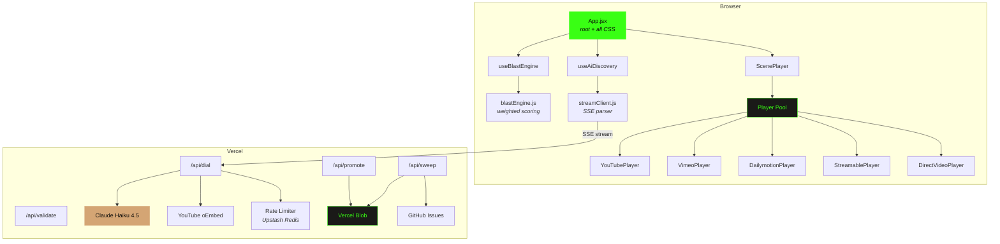
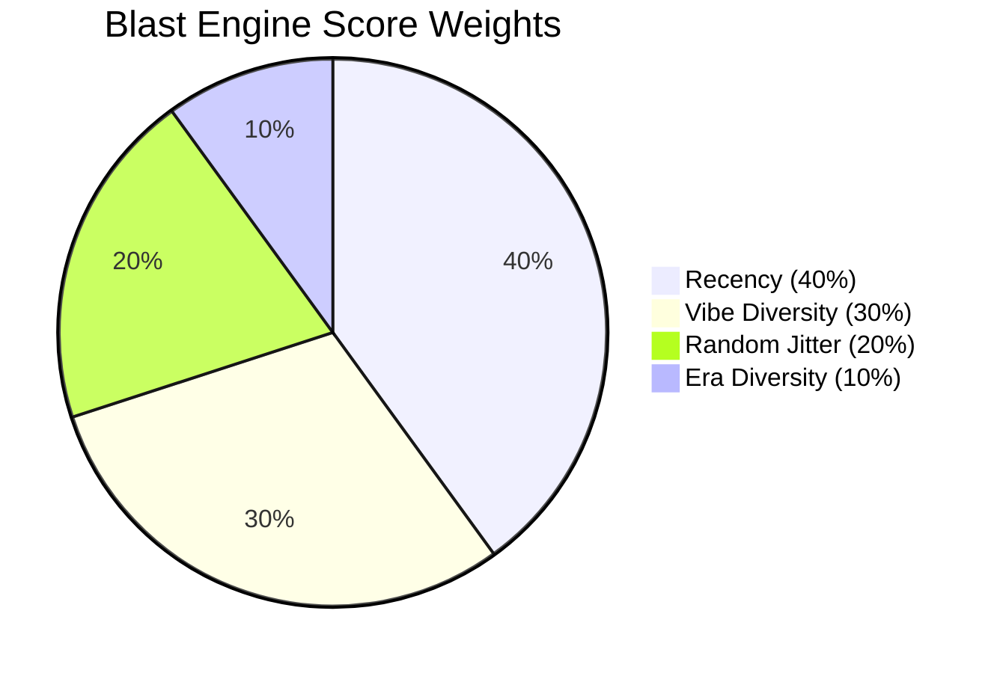
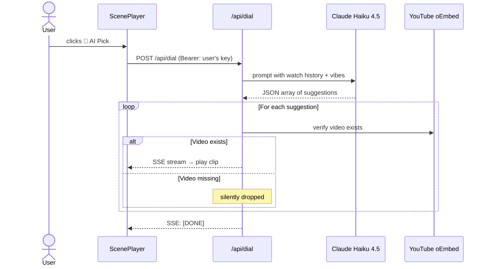
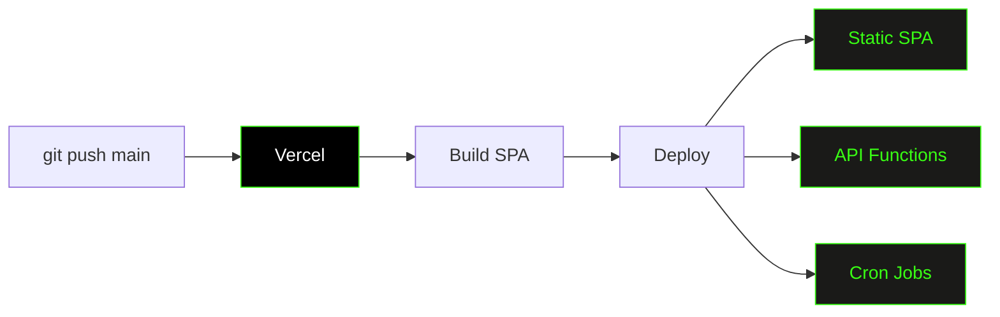

# 📺 Channel Zero

A pirate-TV web app that blasts random video clips through a CRT television you can't turn off. 602 curated clips from YouTube, Vimeo, Dailymotion, and Streamable spanning the entire internet era — from Dancing Baby to modern chaos — with an AI engine that learns your taste and discovers more.

Nobody asked for this. You're welcome.

**Live at [soistartedblasting.com](https://soistartedblasting.com)**

---

## What It Does

**The short version:** Click a button. Watch a clip. Click it again. Repeat until you've wasted an hour. Congratulations, you've been blasted.

**The longer version:** Channel Zero is a retro pirate TV station simulator. It plays curated 15–60 second clips from across internet history in a CRT television UI. A weighted scoring algorithm maximizes variety across vibes and eras while suppressing recently-played clips. An optional AI mode (BYOK Claude API key) suggests new clips based on your watch history, verified in real-time, and streamed to your TV one at a time.

| Feature | Description |
|---------|-------------|
| **⚡ Blast Me** | Weighted selection algorithm balances recency, vibe diversity, and era variety |
| **602 clips** | Curated library spanning Ancient Web → Early Internet → Viral Classics → Modern Chaos |
| **Multi-source video** | YouTube, Vimeo, Dailymotion, Streamable, and direct MP4/WebM |
| **20 vibe filters** | Chaotic Energy, Legendary Fails, Iconic Cinema, Cursed Content, Unhinged Wisdom, and more |
| **4 era filters** | Ancient Web, Early Internet, Viral Classics, Modern Chaos |
| **Favorites & History** | Heart clips to save them, browse your last 50 watches |
| **📡 Discovery** | AI-powered clip discovery — 10 free picks/day, or bring your own Claude API key for unlimited |
| **⬆️ Promote** | Submit AI-discovered clips to a promotion queue for library inclusion |
| **CRT TV chrome** | Retro bezel, channel-change transitions (static → color bars → vertical hold roll) |

---

## How to Use It

### Normal Mode

1. Click **⚡ Start Blasting** on the splash screen (this enables audio — browsers require a click before unmuting)
2. Click **⚡ Blast Me** to channel-surf to a random clip
3. Use the **filter pills** to narrow by vibe or era
4. Click **♡** on any clip to save it to favorites
5. Click **♥** in the header to view and replay saved clips
6. Click **📼 History** to browse recently watched clips
7. Or just sit back — clips auto-advance when they end, like real TV but worse

### AI Discovery

1. Click the **📡 Discovery** button on the TV
2. Get **10 free discoveries per day** — no API key needed
3. Or paste your own **Claude API key** for unlimited discoveries
4. Claude suggests clips based on your watch history, verified against YouTube in real-time
5. Verified clips stream in one at a time — click **⬆️** to promote a great find
6. Click **✕ Exit** to return to normal mode

---

## Architecture

### Overview

### Tech Stack

| Layer | Technology |
|-------|------------|
| Framework | React 18 (client-side SPA) |
| Build | Vite 8 |
| Styling | CSS-in-JS (one massive template literal in App.jsx, as god intended) |
| Video | Multi-source player pool (YouTube, Vimeo, Dailymotion, Streamable, HTML5 video) |
| State | React hooks + localStorage (no Redux, no context, no regrets) |
| AI | Claude Haiku 4.5 via Anthropic API (free tier + BYOK) |
| Rate Limiting | Upstash Redis (10 free AI discoveries/day per IP) |
| API | Vercel Serverless Functions |
| Hosting | Vercel (SPA + API functions + cron jobs) |

**Runtime dependencies:** `react`, `react-dom`, `@vercel/blob`, `@upstash/redis`, `@vercel/edge-config`. Lean and mean.

### The Blast Engine

The app doesn't just pick random clips — it uses a weighted scoring algorithm because random selection is for amateurs who enjoy watching the same clip three times in a row.

Every candidate scene gets a score from 0 to 1:

| Factor | What It Does |
|--------|-------------|
| **Recency** | Recently played scenes get suppressed. Cooldown = 50% of pool size. |
| **Vibe Diversity** | Penalizes clips sharing vibes with your last 5 watches. |
| **Era Diversity** | Penalizes same era as your last 3 watches. |
| **Random Jitter** | Ensures you can't predict what's next. |

The engine also **pre-warms** the next clip — while you're watching, the next scene is already buffered in a hidden player pool. When you blast, it swaps instantly.

### AI Discovery Pipeline

Free tier uses a server-side key with rate limiting (10/day per IP via Upstash Redis). BYOK users pass their Claude key per-request — never stored. Your key, your bill, our plausible deniability.

### Promotion Queue

AI-discovered clips can be promoted for library inclusion. Promoted clips are stored in Vercel Blob, deduplicated by video ID, and reviewed via a CLI script (`scripts/review-promotions.mjs`).

### Dead Link Sweeper

602 clips across 5 platforms means links die constantly. A weekly cron job checks every clip via oEmbed/HEAD requests, stores results in Vercel Blob, and files a GitHub Issue if any are dead.

### Deployment

Push to `main` → Vercel builds the Vite SPA → deploys everything. No split pipelines, no drama.
