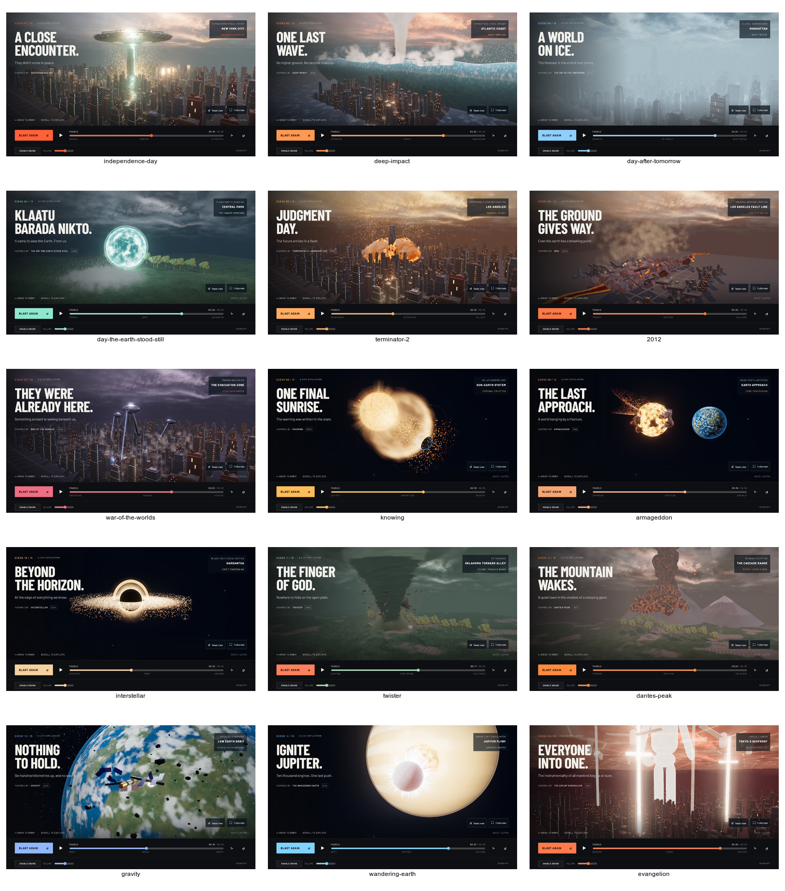

# Graphics A0 capture tooling

Start the built site with `npm run serve`, then use the same capture command for every graphics pass. The quality flag selects the tier through the browser's viewport, touch capability, and device pixel ratio; the tool verifies the canvas actually selected that tier.

```sh
node tools/capture-media.mjs capture --quality ultra --output work/graphics-before
node tools/capture-media.mjs capture --quality high --scene twister --output work/twister-high
node tools/capture-media.mjs probe --quality ultra --scene evangelion --second 16 --output work/probes
node tools/capture-media.mjs compare work/graphics-before work/graphics-after --output work/graphics-diff
```

Every mode targets `http://127.0.0.1:4174`, the port `npm run serve` uses; `--url` or `TEST_BASE_URL` overrides it.

Capture mode uses the fifteen catalogue ids as PNG names and their reviewed hero beats. It writes `capture.json` and an ImageMagick `contact-sheet.jpg`. Repeat `--scene`, or pass comma-separated ids, to capture a subset.
Set `CAPTURE_FONT` to an installed font file when running outside macOS; the default is the system Arial font on this Mac.

Probe mode seeks one scene to `--second`, presses play, and waits until the governor has written two `data-fps` samples: it writes one per three seconds of rendered frames after a three-second cooldown, so about nine seconds. It supports HIGH and ULTRA and reports the requested ceiling, every sample, and the final tier. `--second` must leave room for both samples before the timeline ends; the bound comes from the page's `#progress` max, so 21 today. A run that reaches the end of the timeline with fewer than two samples fails.

Compare mode requires `capture.json` in both directories, matching scene sets, and every listed PNG. It writes per-scene absolute-error images, prints ImageMagick's absolute error and the normalized RMSE for each scene, and creates a diff contact sheet. Both are 0 for identical frames. In ImageMagick 7 the absolute error adds each changed pixel's normalized colour distance, so it equals the changed-pixel count only for full-range changes (a 40×31 white patch on black is 1240; a 1% lift across a 2560×1600 frame is 48188, not 4096000); RMSE runs from 0 to 1 and separates a subtle full-frame regrade from a broken scene. Missing files and mismatched scene sets fail before comparison.

`npm test` first runs `node --check` over every `dist/*.js` module, then runs the unit suite.

## Local evidence (2026-09-16)

Chrome on this Mac, 1280×800 CSS viewport, device scale 2 at ULTRA and 1 at HIGH. All fifteen before/after frames have **0 differing pixels** (ImageMagick AE). Both captures reported zero WebGL/shader errors.

| Scene, from 16 s (one 3 s sample; measured with the earlier fixed 7 s window) | ULTRA FPS / final tier | HIGH FPS / final tier |
|---|---|---|
| Independence Day | 60 / ULTRA | 60 / HIGH |
| Terminator 2 | 60 / ULTRA | 60 / HIGH |
| Day After Tomorrow | 60 / ULTRA | 60 / HIGH |
| War of the Worlds | 46 / ULTRA | 60 / HIGH |
| Evangelion | 59 / ULTRA | 56 / HIGH |

These are the unchanged renderer's baseline results; it already misses 60 FPS in some probes. The existing governor demotes below 38 FPS. Later pieces must distinguish new cost from this baseline.

The baseline full check passed 101 JavaScript tests, 10 certificate tests, 77 asset checksums, build, 11 Chromium tests (including HIGH/ULTRA reverse scrubbing and phone budgets), and 3 WebKit tests. The final tooling-specific suite passes 5 tests, including the installed ImageMagick's `0 (0)` metric format. Full-resolution captures and JSON probes are under ignored `work/graphics-a0-{before,after,probes}`.

The after capture is byte-identical to the before capture, so one sheet stands for both:


