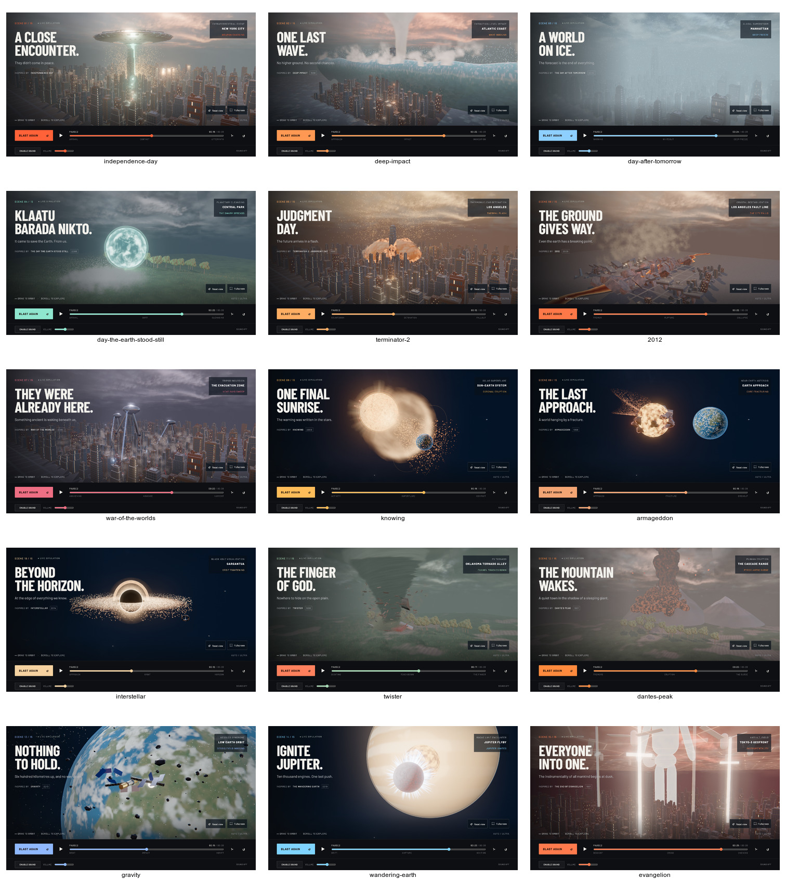

# A2 ambient occlusion and render kit

HIGH and ULTRA composite ground-truth ambient occlusion between the render pass and bloom. `dist/ao-pass.js` subclasses r170's `GTAOPass` (radius 6, distance exponent 1, thickness 1, scale 1, 16 samples, Poisson denoise with 2 rings and 16 samples, blend intensity 1) and keeps the addon's own normal and depth target. Its noise textures come from a seeded generator, so they are identical across pass instances and page loads; the denoise is spatial. HIGH runs the pass at full resolution, ULTRA at 70% of native with the result upsampled bilinearly, the same trade bloom makes at that tier. `setSceneClipBox` bounds the evaluation to the active world (city, landscape or space), so the sky dome and the 650-unit ocean plane cost nothing.

The pass has an explicit `prepass(renderer)` that cinema runs once per frame before the composer: it renders layer 0 normals and depth with the camera restricted to layer 0, points and lines hidden, shadow-map updates frozen, and every renderer state it touched restored in a `finally`. The composite step then skips the addon's internal G-buffer. That order matters because marched volumes read the depth in the same frame: `marchedVolume` in `dist/render-kit.js` (the former `volumes.js`) clamps its march span at the reconstructed opaque world point along the ray and discards zero or negative spans, which removes the tight-hull artefact of opaque objects inside a hull margin drawing behind the volume. Depth availability is cleared on every tier change and set only by a successful prepass, so BALANCED and LITE never sample the texture, and the depth UVs divide by the full colour-buffer size even when the ULTRA target is smaller.

`render-kit.js` also owns the effects layer. `markEffect` puts every renderable descendant on layer 1 exclusively and stops it casting shadows; `markEffects` classifies points, lines, sprites and any transparent or additive material, and skips objects flagged `userData.opaqueDepth`. Cinema enables layers 0 and 1 on the main camera and classifies the scene once at setup; each lazy terrestrial and cosmic factory group is classified when it is built; production's sky and shader fire, the baked explosion's smoke and cloud, atmosphere's domes and mist, and cosmic's stars are marked where they are created. The shared ocean and wave are flagged `opaqueDepth`: water is a physical surface, so it stays in the depth buffer and occlusion and marches stop at it. Other transparent physical surfaces, such as the ice overlays, are effects and give up shared-depth occlusion; that is the contract, applied consistently. `data-ambient-occlusion` reports `gtao` at HIGH and ULTRA and `none` below, and `data-triangles` and `data-draw-calls` include the prepass at those tiers.

Unit tests cover classification including material arrays, the tier flags, per-canvas uniform isolation and sizing, noise reproducibility across instances, the prepass state save and restore including on failure, the volume shader's clamp, every lazy factory across all fifteen ids (Deep Impact's factory is three marched volumes over the shared city, so it is the one scene with no opaque factory mesh), and the water flag. The browser suite asserts `gtao` at HIGH and ULTRA with the reverse-scrub byte equality running with the pass on, and `none` at phone size.

## Local evidence (2026-09-16)

Stacked on A1 (`adbe951`). Chrome on this Mac, 1280×800 CSS viewport at device scale 2 (ULTRA). The before set is the A1 capture; the after set is this branch at the same fifteen hero beats. Both report zero WebGL/shader errors.

**Compare.** ImageMagick absolute error (distance-weighted, see the A0 note) and normalized RMSE, A1 to A2:

| Scene | Absolute error | RMSE |
|---|---|---|
| independence-day | 2,619 | 0.0025 |
| deep-impact | 2,291 | 0.0053 |
| day-after-tomorrow | 1,775 | 0.0028 |
| day-the-earth-stood-still | 765 | 0.0016 |
| terminator-2 | 1,855 | 0.0027 |
| 2012 | 1,467 | 0.0028 |
| war-of-the-worlds | 1,875 | 0.0027 |
| knowing | 3,642 | 0.0193 |
| armageddon | 1,291 | 0.0013 |
| interstellar | 4 | 0.0001 |
| twister | 2,140 | 0.0065 |
| dantes-peak | 468 | 0.0012 |
| gravity | 14 | 0.0002 |
| wandering-earth | 22 | 0.0002 |
| evangelion | 3,121 | 0.0034 |

Space scenes barely move (RMSE at or below .0002) because their opaque bodies are few and the clip box is the space bounds. City and landscape scenes move by RMSE .001 to .006, which is the occlusion darkening creases. Knowing is the outlier at .019: its Earth sits inside the ejection volume's hull and now renders in front of the march instead of behind it.

**Occlusion walk.** An amplified difference of a street-level crop of Independence Day shows the change following building edges, alley floors and roof edges, with flat facades unchanged, so the 6 unit radius against 3 to 6 unit buildings behaves as the spec intends. Full-resolution crops of Twister and Knowing show the depth clamp at work: the farm at the funnel's foot and the Earth inside the ejection both draw in front of the volume now. Nothing in the sky or space backgrounds changes.

**Frame rate.** Probes from 16 s with the two-sample probe on the five heaviest scenes:

| Scene, from 16 s | ULTRA samples / final tier | HIGH samples / final tier |
|---|---|---|
| Independence Day | 60, 60 / ULTRA | 60, 60 / HIGH |
| Terminator 2 | 60, 60 / ULTRA | 60, 60 / HIGH |
| Day After Tomorrow | 60, 60 / ULTRA | 60, 60 / HIGH |
| War of the Worlds | 60, 60 / ULTRA | 60, 60 / HIGH |
| Evangelion | 59, 60 / ULTRA | 59, 60 / HIGH |

The prepass and the occlusion cost nothing measurable at either tier on this Mac, no probe demoted, and nothing dips below 60 at ULTRA, so the spec's profiling rule is not triggered. Full-resolution captures, the compare set and the probe JSON are under ignored `work/graphics-a2-{final,diff,final-probes}`.

Checks on this tree: 118 unit tests behind the syntax check (17 dist modules), 10 certificate tests, asset checksums, the production build, 11 Chromium tests (reverse scrubbing with the pass on at HIGH and ULTRA, the phone budget, the tier attribute at HIGH, ULTRA and phone size) and 3 WebKit tests.

Before, the A1 grade (see [the A1 note](graphics-a1-film.md)):

After:

