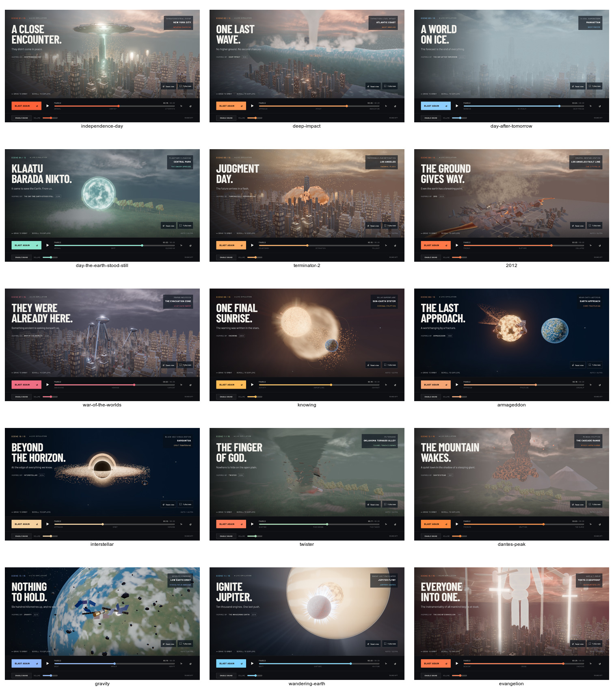

# A3 soft textured particles

All shader particle factories and the snow, foam, window and star point systems
share one optional 1024-square atlas. Its sixteen cells contain four puffs, four
embers, four streaks, two droplets and two snowflakes. The fixed seed, linear
coverage encoding, authoring script and asset checksum make it reproducible.

Cell selection and rotation come from stable particle seeds. Streak orientation
uses the existing motion formula evaluated at time and time + 0.04; the formulas
themselves are unchanged. HIGH and ULTRA soften intersections using the current
frame's opaque depth and actual drawing-buffer size. Lower tiers sample only the
atlas. No additional depth pass or geometry is introduced. Simulation debris is
an instanced mesh, not a point-sprite system, and retains its geometry.

The texture loads once per canvas, wakes paused rendering on success or failure,
and falls back to each factory's original procedural fragment on failure.
`data-particle-atlas` reports loading, ready or fallback; `data-soft-particles`
reports atlas or depth-fade. Transparent point systems do not write invisible
square fragments into the depth buffer.

Validation covers all motion-kind cell ranges, one-time optional loading,
failure fallback, GPU shader compilation, depth fades and reverse-time equality.
The BALANCED browser check verifies exactly one atlas request and no depth effects.
Detailed stage evidence is stored under `work/a3/`; see the final integration report
for measured performance and verification limitations.

The atlas regenerated byte-for-byte with Pillow 12.1.0 and NumPy 2.2.5:
Git blob `40a73f0948835f68a508e391c27ec3bfe0852074`, 97,906 bytes.
All fifteen ULTRA captures retain the scene subjects and effects; sprite coverage
changes locally around smoke, sparks, snow and spray, without adding geometry.

