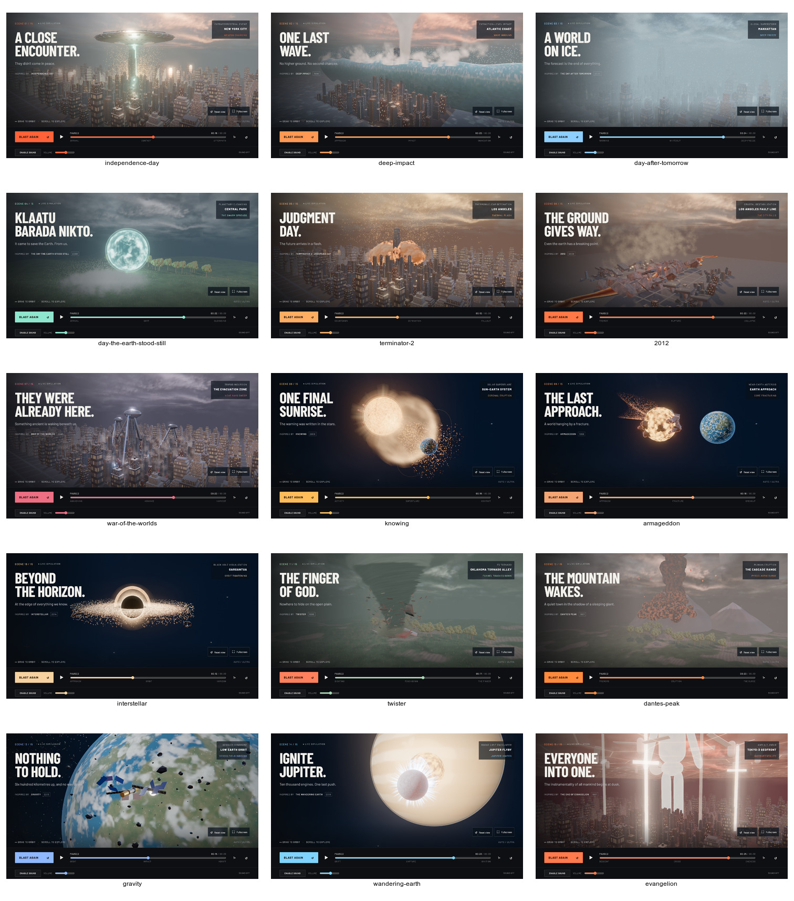

# A4 soft sun shadows

Directional sun shadows use a deterministic 16-tap blocker search followed by a
16-tap Poisson filter. The filter radius grows with receiver-to-blocker separation;
the rotation hashes reconstructed world position, not time. HIGH and ULTRA retain
2048 and 4096 shadow maps. Lower tiers keep shadows disabled.

The patch is installed once before material compilation. Only the directional sun
opts into PCSS; other lights retain the stock shadow path. City and landscape
bounds are fitted in light space after `applyEnvironment` resets the sun. Resetting
the sun after fitting invalidated the original implementation's clipping bounds;
the integration fixes that ordering and resets the target when entering space.

`data-sun-shadows` reports `pcss` or `none`. The adaptive-resolution controller and
the optional development postprocessing pipeline remain available.

## Verification, 2026-09-19

Node 24: 134 unit tests pass; the opt-in PCSS GPU test is separately covered by
the integration GPU run. Certificates, asset hashes and the production build pass.
Chrome passes 11 of 12 tests. The catalogue test completes the fifteen-scene
reverse-scrub checks but fails its existing camera-reset pixel tolerance (12 pixels
versus a limit of 4), including on targeted retry. The failure is not waived or
hidden by raising the threshold. WebKit is unverified: its missing browser binary
could not be downloaded from Playwright's mirrors.

All fifteen ULTRA screenshots captured without renderer errors. Detailed manifests,
comparisons against current main, and HIGH/ULTRA probes are retained under
`work/a4/`. The final integration report records the performance results.

