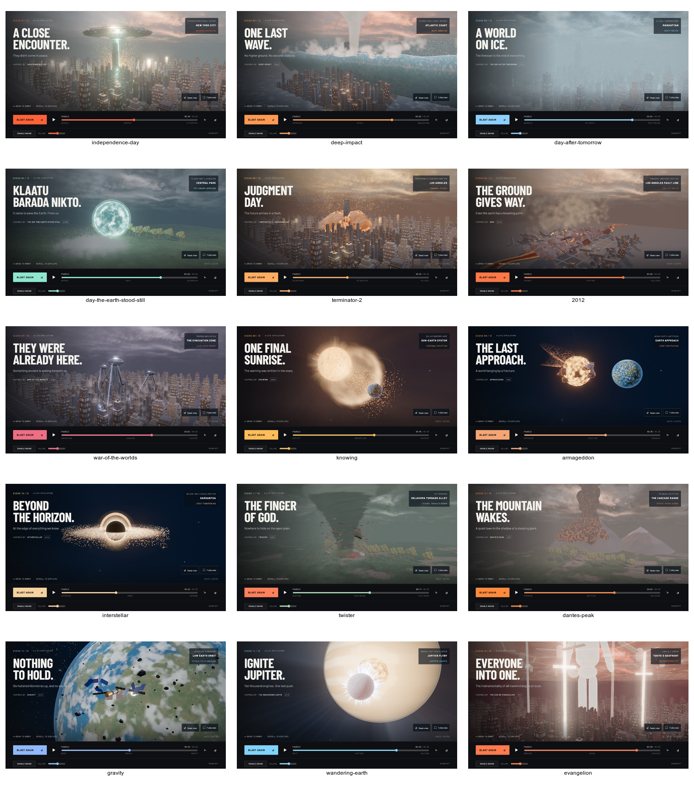

# A5 hero lighting and shafts

Nine scene grades describe an emitter position, colour, light range, intensity,
shaft strength and four-point time envelope. Hero point lights apply at every tier;
HIGH and ULTRA add shafts before bloom. Scenes without an emitter skip the pass.

The pass thresholds visible HDR colour near the projected emitter, performs three
quarter-resolution six-tap radial blurs, and adds the result to the original image.
It uses two alternating targets, no temporal history and no extra depth prepass.
Hidden emitter pixels cannot seed the mask. Projection updates on every rendered
frame, including paused camera orbit; emitters behind the camera or off screen
disable the pass. `data-light-shafts` reports the active emitter or `none`.

The production composer and optional development postprocessing pipeline both run
shafts after AO and before bloom. Adaptive resolution is retained.

Evidence and validation limitations are recorded in the final integration report;
local captures, comparisons and probes are stored under `work/a5/`.

All fifteen ULTRA captures completed without renderer errors. Visual inspection
retains each scene's hero effect; shafts are most visible around Knowing's sun and
Jupiter's limb. Chrome's HIGH-tier beam assertion and reverse scrubbing pass.
The unchanged camera-reset tolerance fails as in A4; WebKit remains unavailable.

